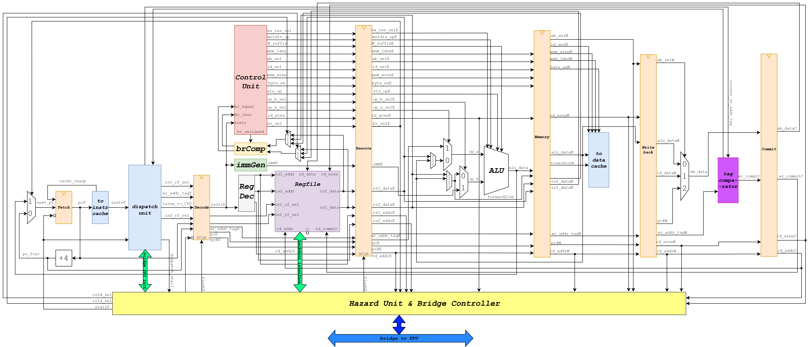
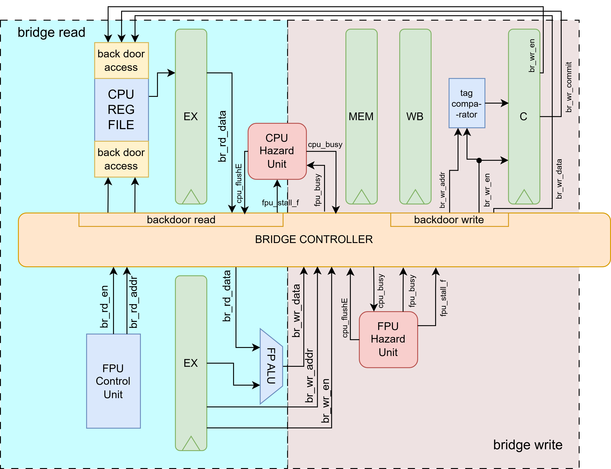

# CPU (RV64IM)

**Folder**: `CPU/`

## About The CPU Pipeline

This is the **in-order 6-stage RV64IM integer pipeline** (Fetch → Decode → Execute → Memory → Writeback → Commit) integrated with the Tomasulo dispatcher for out-of-order issue to both integer and floating-point units.

The pipeline supports the full RV64I base ISA plus the M extension (multiply/divide), with full forwarding, hazard detection, branch resolution, and a bridge interface to the FPU coprocessor. It is designed to maximize throughput while maintaining in-order commit semantics.

## Architecture Overview

- Bridge architecture for communication between CPU & FPU

   

## Pipeline Stages

1. **Fetch**  
   - PC register + add4  
   - Instruction memory access via I-Cache  
   - Simple sequential fetch (no branch prediction yet)

2. **Decode**  
   - Instruction decode (`ctrl_unit`, `immGen`, `reg_dec`)  
   - Register file read (`regfile` – dual-ported with temp/main copies)  
   - Forwarding muxes (`rs1d_mux`, `rs2d_mux`) for data hazards  
   - Hazard detection (`hazard_unit`)

3. **Execute**  
   - Operand muxes (`op_a_mux`, `op_b_mux`)  
   - Main ALU (`alu`) for arithmetic/logic/shift  
   - MUL/DIV unit (separate path, selected by `ex_res_mux`)  
   - Branch comparator (`brcomp`) + branch mux (`br_mux`)

4. **Memory**  
   - Load/store address calculation  
   - Data memory access via D-Cache  
   - Load data selection (`ld_sel`)

5. **Writeback**  
   - Writeback mux (`wb_mux`) selects ALU result, load data, or PC+4  
   - Write to architectural register file

6. **Commit**  
   - In-order commit via `reg_writeback_commit`  
   - Tag comparison (`tag_comparator`) triggers CDB broadcast  
   - Clears busy flags and ROB tags in register managers

## Key Features

- **Full forwarding** from EX/MEM/WB/Commit stages to resolve RAW hazards without stalls (except load-use).  
- **Load-use hazard stall** detected in `hazard_unit` (classic 1-cycle stall).  
- **Branch resolution** in EX stage → flush Fetch/Decode on mispredict (simple predict-not-taken).  
- **Register renaming** via Tomasulo tags (ROB indices) handled by dispatcher.  
- **Bridge to FPU** allows CPU to read/write FPU registers directly (backdoor path).  
- **Dual register file copies** (main + temporary) to support renaming without physical register file expansion.

The CPU pipeline is tightly coupled with the **Tomasulo dispatcher** (described in `dispatch/README.md`), which enables out-of-order issue while preserving in-order fetch and commit — the classic superscalar foundation for this RV64IM + RV64D SoC.
