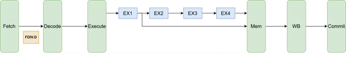
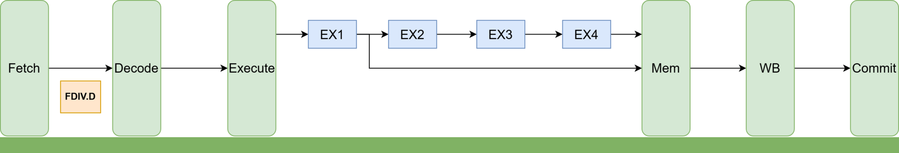
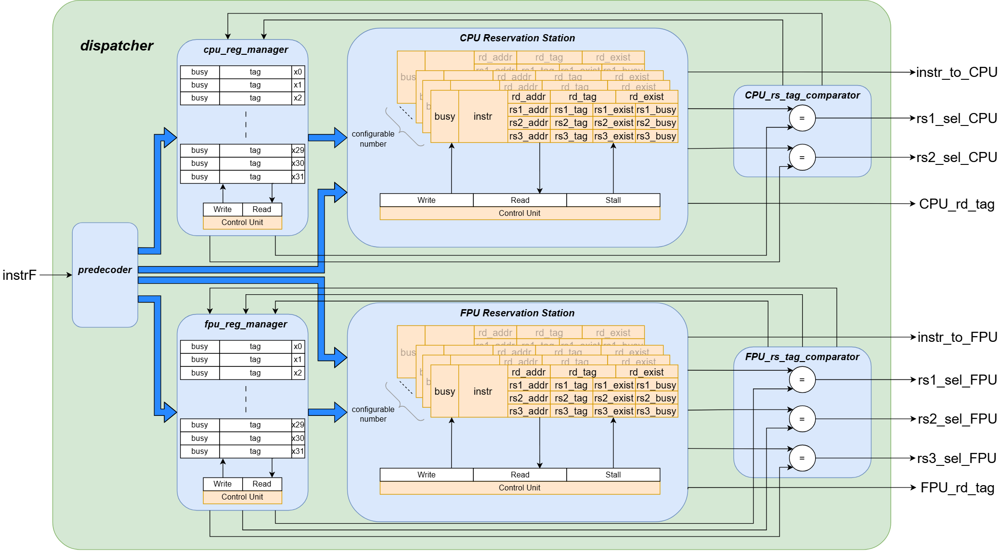

# DISPATCH UNIT (Tomasulo Out-of-Order Scheduler)

**Folder**: `CPU/dispatch/`

## About The Dispatch Unit
This module implements the **Tomasulo algorithm** for dynamic out-of-order execution in the RV64IM + RV64D SoC. It receives instructions from the CPU pipeline (after Fetch), performs pre-decoding, register renaming, dependency checking, and issues instructions to either the integer CPU pipeline or the FPU pipeline while resolving RAW, WAR, and WAW hazards.

The unit guarantees:
- In-order fetch & commit
- Out-of-order issue & execution
- Correct handling of long-latency FPU operations (div, sqrt, FMA)

Advantages of Out-of-Order execution compared to in-order:
    
- In-order:

    

- Out-of-Order:

    

## Architecture Overview

## Key components:
- **Pre-decoder**: Classifies instruction (CPU/FPU), extracts fields, detects long-latency ops.
- **ROB_counter**: Generates unique ROB tags for register renaming.
- **CPU_reg_manager / FPU_reg_manager**: Maintain busy flags, ROB tags, and long-command tracking for each architectural register.
- **CPU/FPU Reservation Station**: Hold pending instructions until operands are ready.
- **Tag Comparators**: Resolve register renaming for forwarding (main vs. temporary register file).
- **Arbiter**: Prioritizes and issues one ready instruction per cycle (CPU or FPU).

## Hazard Handling (Tomasulo)

- **RAW**: Handled by waiting in Reservation Station until tag match from CDB (Common Data Bus).
- **WAW**: Resolved by register renaming + tag comparison at Write-Back.
- **WAR**: Resolved by reading from temporary register file when current tag differs from issue-time tag.

## Files

| File                        | Description                                      |
|-----------------------------|--------------------------------------------------|
| [dispatch.sv](./dispatch.sv)               | Top-level dispatcher module                      |
| [pre_decoder.sv](./pre_decoder.sv)            | Instruction classification & field extraction    |
| [ROB_counter.sv](./ROB_counter.sv)            | ROB tag generator                                |
| [CPU_reg_manager.sv](./CPU_reg_manager.sv)        | Register state tracking for integer pipeline     |
| [FPU_reg_manager.sv](./FPU_reg_manager.sv)        | Register state tracking for floating-point       |
| [CPU_reservation_station.sv](./CPU_reservation_station.sv)| Reservation station for CPU instructions         |
| [FPU_reservation_station.sv](./FPU_reservation_station.sv)| Reservation station for FPU instructions         |
| [CPU_rs_tag_comparator.sv](./CPU_rs_tag_comparator.sv)  | Tag comparison for integer renaming              |
| [FPU_rs_tag_comparator.sv](./FPU_rs_tag_comparator.sv)  | Tag comparison for FPU renaming                  |
| [arbiter.sv](./arbiter.sv)                | Issues one ready instruction per cycle           |

## Integration

The dispatch unit sits between the CPU's Fetch/Decode stages and the execution pipelines. It receives `instr_f` and `stall_f`, and outputs ready instructions + renamed tags to both CPU and FPU pipelines.

For full system context, see the main SoC diagram in the repository root.
