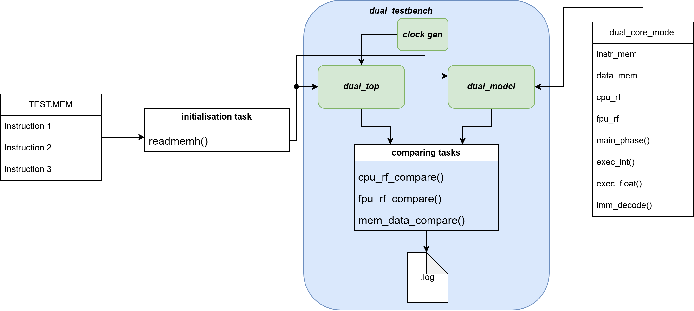
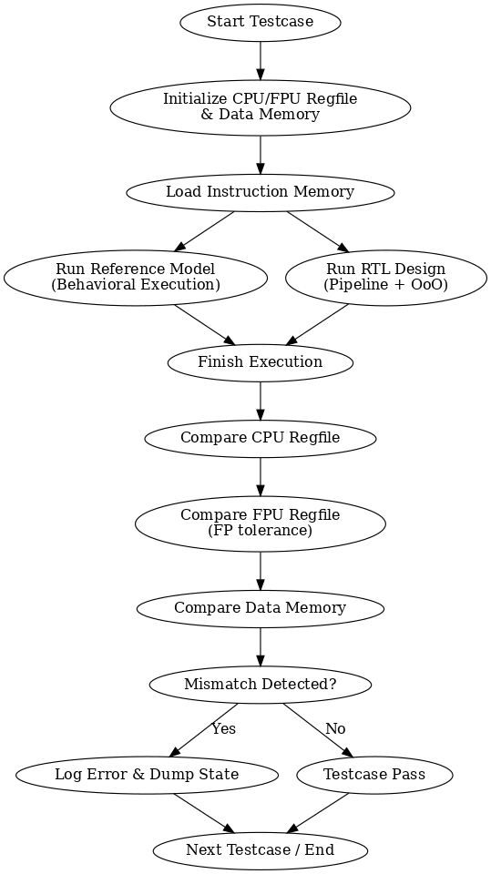

# Testbench & Verification Framework

**Folder**: `test/`

## About The Testbench

This is a **parallel golden-model verification environment** for the full RV64IM + RV64D SoC (dual_top).  

It runs the RTL DUT and a cycle-accurate behavioral reference model **simultaneously** on the same instruction stream (`ALL_test.mem`), then automatically compares:
- CPU register file
- FPU register file (with IEEE-754 ULP tolerance)
- Data memory

Any mismatch is logged with exact values and ULP distance. The framework supports all RV64IMD instructions (including fused multiply-add, conversions, and CSR) and is used for both functional sign-off and regression testing.

## Architecture Overview

### Verification Flow

1. **Setup Phase**  
   - `$readmemh` loads instruction memory  
   - Clock/reset generation + VCD dump  
   - Reference model (`dual_core_model`) is instantiated and starts executing in parallel

2. **Simulation Phase**  
   - DUT runs for exactly `lines × 36` cycles (36 cycles = worst-case FPU latency + MUL/DIV)  
   - Reference model executes the same instructions sequentially (golden values stored in arrays)

3. **Comparison Phase** (after simulation ends)  
   - **CPU RF**: exact match check  
   - **FPU RF**: ULP difference ≤ 4 (IEEE-754 compliant tolerance)  
   - **Data Memory**: 256-bit lines broken into 64-bit words, ULP-checked for FP data  
   - All errors logged with address, received vs expected values, and ULP count

### Key Features

- **Zero-stall parallel execution** — reference model runs alongside RTL  
- **ULP-based FP checking** (tolerance = 4) for all double-precision results  
- **Full RV64IMD coverage** (including FMA, conversions, sign-injection, classify)  
- **Automatic instruction counting** from `.mem` file  
- **Detailed logging** (`dual_testbench.log`) with line numbers and timestamps  
- **Waveform dump** (`dump.vcd`) for debug  
- **Error counter** — final summary shows total mismatches  

This testbench is the primary verification vehicle for the entire SoC. It guarantees functional correctness before synthesis or FPGA deployment.