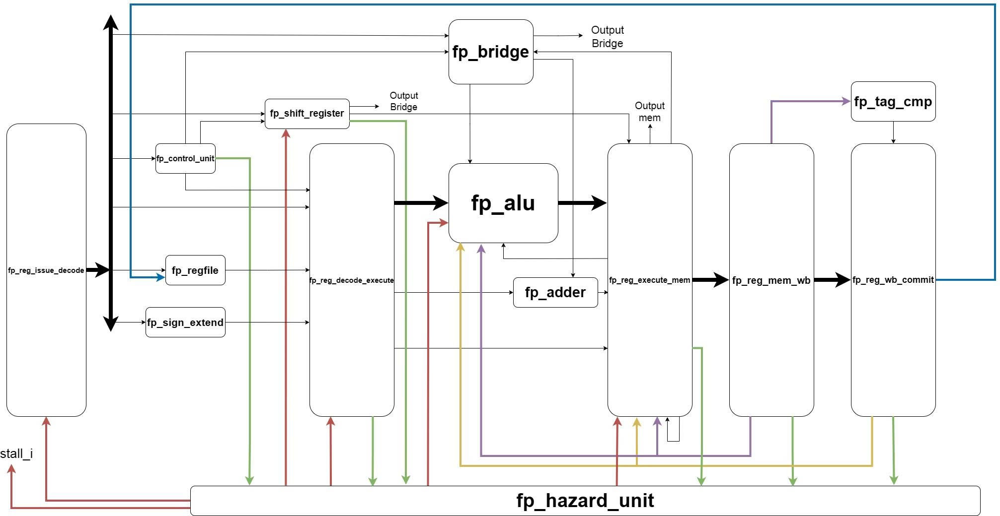

# Floating-Point Unit (RV64D FPU Coprocessor)

**Folder**: `FPU/`

## About The FPU

This is the **independent RV64D double-precision FPU coprocessor** integrated into the RV64IM + RV64D SoC.  
It implements the full **D Extension** (IEEE-754 compliant) with support for fused multiply-add (FMA), conversions, sign-injection, comparisons, and classify instructions.  

The FPU operates in parallel with the integer CPU core via a dedicated bridge, using **Internal Out-of-Order execution** combined with hazard handling to hide long-latency operations (FDIV = 14 cycles, FSQRT = 17 cycles).

## Architecture Overview

### Pipeline Stages (4-stage internal pipeline)

1. **Decode**  
   - FP Control Unit: decodes opcode/funct/fcvt_op/rm → generates fp_opcode, en, reg_write, rm_sel, wb_sel, bridge signals  
   - FP Register File: reads rs1/rs2/rs3 (64-bit double)  
   - FP Sign Extend: sign-extends 12-bit immediate  

2. **Execute**  
   - FP ALU: performs all FP operations (FADD/FSUB/FMUL/FDIV/FSQRT/FMA…)  
   - Dedicated Adder for address calculation  
   - MUXes for hazard forwarding  

3. **Memory**  
   - FP LSU (temporary for simulation): load/store interface to D-Cache  
   - Pipeline registers  

4. **Writeback**  
   - Writes result back to FP Register File (or bridge to CPU RF)  

### Key Innovation: Internal Out-of-Order + Hazard Handling

- **Shift Register (18 entries)** stores state signals of long-latency instructions  
- **Hazard Unit** detects RAW, Load-Use, structural hazards and issues stall/flush/forward  
- **Internal OoO** allows short instructions to bypass long ones (FDIV/FSQRT) while preserving correctness  
- Uses `is_raw`, `is_long_hazard`, `occupied` flags + `div_sqrt` bit for precise control  

This combination solves the classic problem of long-latency FP ops blocking the pipeline while maintaining in-order commit semantics.

### Features

- Full IEEE-754 double-precision support (RNE/RTZ/RDN/RUP/RMM/DYN rounding)  
- NaN-boxing compatibility with F Extension  
- Bridge to CPU for FMV.X.D / FMV.D.X and FCSR access  
- Hazard-free forwarding (EX→EX, MEM→EX)  
- Shift-register state tracking for safe OoO execution  

The FPU is fully verified with the parallel golden-model testbench and synthesized on AMD Zynq UltraScale+ (part of the complete SoC results).