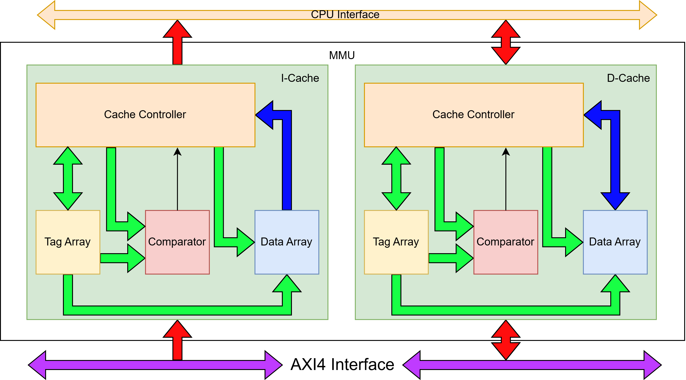
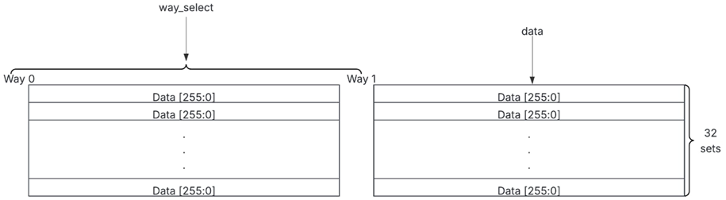
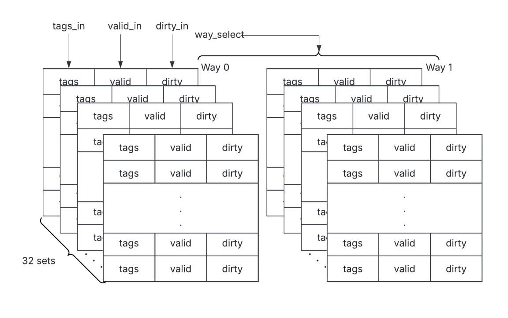
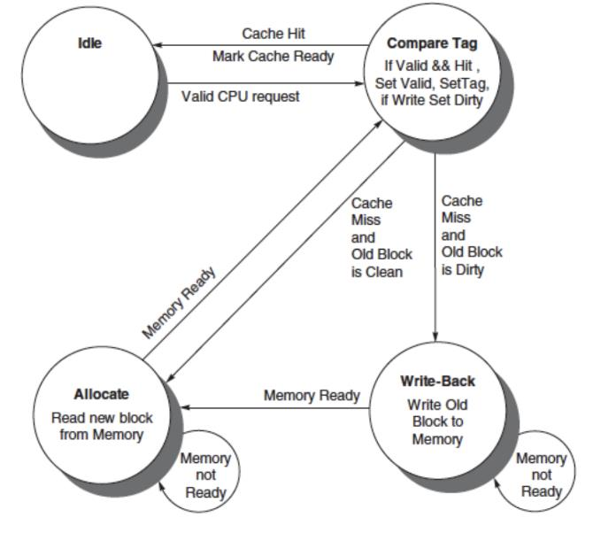

# Memory Management Unit (MMU + L1 Caches)

**Folder**: `MMU/`

## About The MMU

The **Memory Management Unit** is the unified memory subsystem of the RV64IM + RV64D SoC. It provides Harvard-style L1 caching (separate I-Cache and D-Cache) while presenting a single AXI-4 master interface to external memory.  

It handles:
- Instruction fetches from the CPU pipeline
- Load/Store requests from both the RV64IM CPU and RV64D FPU
- Cache coherence, write-back policy, LRU replacement, and byte/half/word/double-word alignment

The design uses 2-way set-associative caches (32 sets, 256-bit / 32-byte lines) with full AXI-4 burst support, achieving high hit rate while keeping the external memory interface simple.

## Architecture Overview

- Cache architecture

    

- Tag array architecture

    

- Controller FSM

    

### Key Sub-Modules Inside MMU

1. **I_Cache**  
   - Read-only instruction cache  
   - 2-way set-associative, 32 sets, 256-bit lines  
   - Simple hit/miss FSM (Allocate only, no write-back)  
   - Returns 32-bit instruction to CPU Fetch stage

2. **D_Cache**  
   - Read/Write data cache (supports CPU + FPU)  
   - 2-way set-associative, write-back policy, dirty bits  
   - LRU replacement + write-allocate on miss  
   - Handles 8/16/32/64-bit loads/stores with sign/zero extension

3. **lsu_controller**  
   - Arbitrates CPU and FPU memory requests  
   - Generates correct byte enables, address alignment, and data formatting  
   - Performs sign/zero extension and byte/half-word merging for loads  
   - Routes FPU double-precision accesses directly to D_Cache

4. **Shared AXI-4 Master Interface**  
   - Single port to main memory (32-byte bursts)  
   - Handles both I-Cache and D-Cache misses transparently

### Cache Features

- **2-Way Set-Associative** (32 sets → 1 KB I-Cache + 1 KB D-Cache data storage)  
- **Write-Back + Write-Allocate** on D-Cache  
- **LRU replacement** per set  
- **Full 256-bit line** (perfect for 64-bit RISC-V + double-precision FPU)  
- **Error detection** in TagArray/DataArray/Comparator (for debugging)  
- **Separate read paths** for CPU and FPU to avoid contention

The MMU sits between the CPU/FPU pipelines and the external AXI-4 memory fabric, dramatically reducing memory latency while maintaining full compatibility with RV64IM and RV64D load/store instructions.