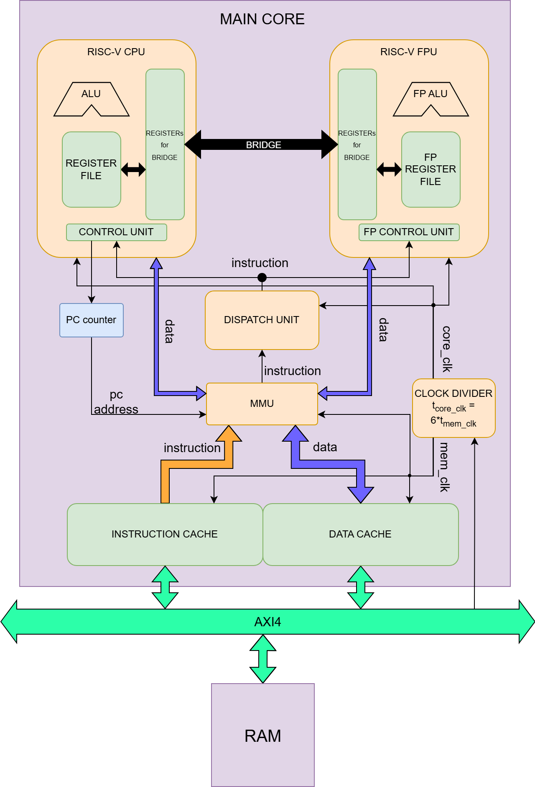
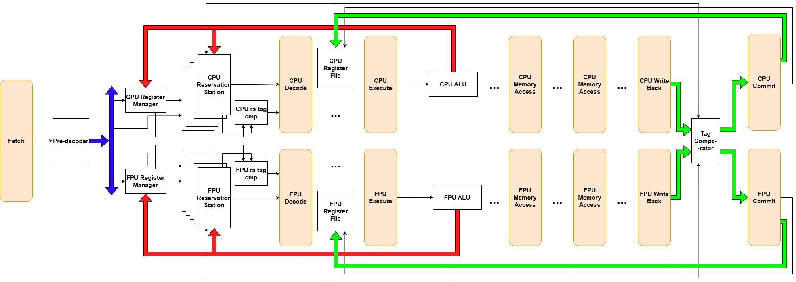
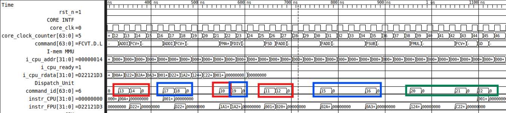
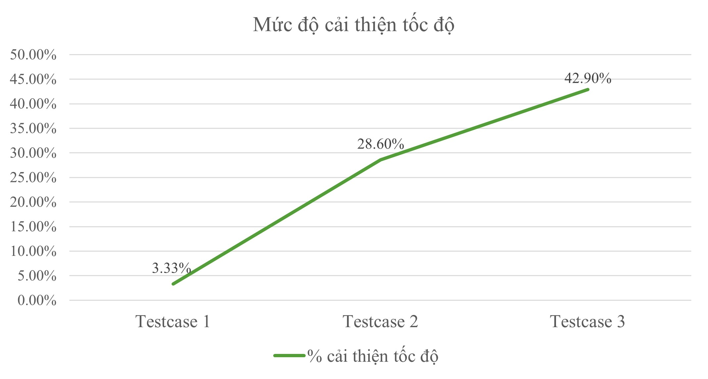
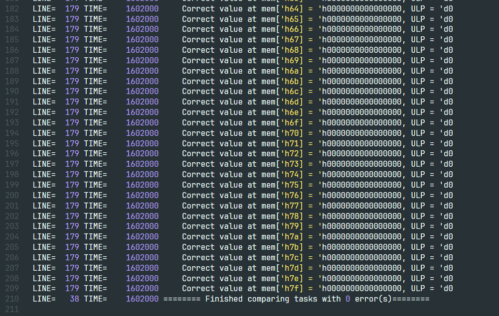
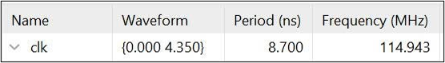
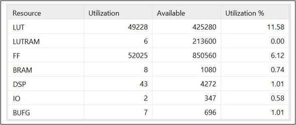
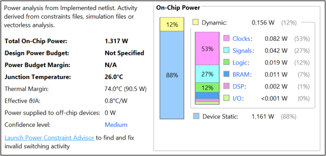

<a id="readme-top"></a>
<!-- PROJECT SHIELDS -->
<!--
*** I'm using markdown "reference style" links for readability.
*** Reference links are enclosed in brackets [ ] instead of parentheses ( ).
*** See the bottom of this document for the declaration of the reference variables
*** for contributors-url, forks-url, etc. This is an optional, concise syntax you may use.
*** https://www.markdownguide.org/basic-syntax/#reference-style-links
-->
[![Contributors][contributors-shield]][contributors-url]
[![Forks][forks-shield]][forks-url]
[![Stargazers][stars-shield]][stars-url]
[![Issues][issues-shield]][issues-url]
[![Unlicense License][license-shield]][license-url]
[![LinkedIn][linkedin-shield]][linkedin-url]

<!-- TABLE OF CONTENTS -->
<details>
  <summary>Table of Contents</summary>
  <ol>
    <li>
      <a href="#about-the-project">About The Project</a>
	  <ul>
        <li><a href="#key-features">Key Features</a></li>
		<li><a href="#project-components">Project Components</a></li>
		<li><a href="#project-architecture">Project Architecture</a></li>
      </ul>
    </li>
    <li>
      <a href="#getting-started">Getting Started</a>
      <ul>
        <li><a href="#prerequisites">Prerequisites</a></li>
        <li><a href="#installation">Installation</a></li>
      </ul>
    </li>
    <li><a href="#how-to-run">How to run</a></li>
    <li><a href="#achievement">Achievement</a></li>
    <li><a href="#contributing">Contributing</a></li>
    <li><a href="#contact">Contact</a></li>
  </ol>
</details>


<!-- ABOUT THE PROJECT -->
## About The Project

This graduation thesis presents a complete __RISC-V 64-bit SoC__ integrating a RV64IM integer CPU core and an independent RV64D double-precision FPU coprocessor. The FPU operates in parallel with the CPU using the Tomasulo algorithm (Reservation Stations, Register Renaming, Reorder Buffer) to enable true out-of-order execution, significantly reducing pipeline stalls and improving performance on floating-point workloads.
The system also includes a Memory Management Unit (MMU), L1 instruction and data caches, and AXI4 interconnect for memory consistency and scalability. The design fully supports IEEE-754 double-precision arithmetic and has been verified with a parallel reference-model testbench.

<p align="right">(<a href="#readme-top">Back to top</a>)</p>


### Key Features

* [__RV64IM CPU__](./CPU/): 6-stage pipeline (IF–ID–EX–MEM–WB–Commit) with [Tomasulo dispatch](./CPU/dispatch/) for out-of-order issue.
* [__RV64D FPU Coprocessor__](./FPU/): Independent pipeline supporting all double-precision instructions (add, sub, mul, div, sqrt, FMA, conversions, comparisons, sign injection, classify, move).
* __Tomasulo Out-of-Order Execution__: Full handling of RAW, WAR, and WAW hazards via Reservation Stations, Register Renaming, and Reorder Buffer.
* [__MMU + L1 Cache__](./MMU/): 2 KB 2-way set-associative I-Cache and D-Cache with write-back policy and AXI4 interface.
* [__AXI4 Interconnect__](./AXI_4/): Standard AMBA AXI4 for memory transactions between CPU, FPU, MMU, and external memory.
* [__Parallel Verification__](./Dual_core/test/): Reference behavioral model runs concurrently with RTL in the same testbench for cycle-accurate comparison.
* __FPGA Implementation__: Synthesized and timing-closed on AMD Zynq UltraScale+ RFSoC ZCU208 Evaluation Kit.

<p align="right">(<a href="#readme-top">Back to top</a>)</p>

### Project Components

#### Folder Structure (SystemVerilog RTL):
* [CPU/](./CPU/): RV64IM core, pipeline stages, Hazard Unit, Tomasulo Dispatch Unit.
* [FPU/](./FPU/): RV64D coprocessor, FP ALU (FMA, divider, sqrt), Register File, Shift-Register state manager.
* [MMU/](./MMU/): Memory Management Unit and address translation.
* [AXI4/](./AXI_4/): AXI4 master/slave interfaces and interconnect.
* [Dual_core/](./Dual_core/): Top-level SoC integration of CPU + FPU + bridge.
* [Testbench/](./Dual_core/test/): Parallel reference-model testbench, testcases, waveform scripts.

#### Python Scripts:
* [RV64IMD_assembler.py](./Dual_core/include/RV64IMD_assembler.py): Converts RV64IMD assembly code from [input_instr.txt](./Dual_core/run/input_instr.txt) to machine code stored in [ALL_test.mem](./Dual_core/mem/ALL_test.mem), with support for rounding mode selection (RNE, RTZ, RDN, RUP, RMM, DYN), label handling & forward/backward branches, comment stripping and basic preprocessing & detailed error messages with line context.

#### Testbench and Simulation:
* [dual_testbench.sv](./Dual_core/test/dual_testbench.sv): Top-level SystemVerilog testbench. It instantiates the [dual_top.sv](./Dual_core/top_module/dual_top.sv) DUT, generates clock/reset, loads [ALL_test.mem](./Dual_core/mem/ALL_test.mem) into instruction memory, runs the design, then automatically extracts final CPU RF, FPU RF and data memory values and compares them against the reference model.
    * Uses ULP-based floating-point comparison (tolerance = 4) for FPU registers and memory.
    * Detailed logging to [dual_testbench.log](./Dual_core/run/my_work_dir/dual_testbench.log) with line numbers and timestamps.
    * Automatic VCD waveform dump [dump.vcd](./Dual_core/run/my_work_dir/dump.vcd).
* [reference_model.sv](./Dual_core/test/reference_model.sv): Pure behavioral golden model (dual_core_model class). It reads the same ALL_test.mem, executes every instruction sequentially according to the RV64IMD ISA specification (including all FPU operations with IEEE-754 semantics), and records final CPU RF, FPU RF and data memory states for comparison.
* [header.svh](./Dual_core/test/header.svh): Central include file that pulls in all RTL modules (FPU pipeline, CPU pipeline, dispatch unit, MMU, caches, AXI4 interfaces, etc.) and defines the convenient `disp macro for formatted logging.
* [run.sh](./Dual_core/run/run.sh): Automates simulation and error reporting.


#### Instruction Set:
* Defined in [ops table.xlsx](./Dual_core/include/ops%20table.xlsx), detailing basic instructions with their opcodes, formats, and examples.

#### Sample Programs:
* [test_library/](./Dual_core/test/test_library/): Contains RV64IMD assembly programs.

<p align="right">(<a href="#readme-top">Back to top</a>)</p>

### Project Architecture

* Overall architecture


* Tomasulo algorithm architecture


<p align="right">(<a href="#readme-top">Back to top</a>)</p>

<!-- GETTING STARTED -->
## Getting Started

To set up and run the project locally, you need to install the required tools and follow the installation steps below.

### Prerequisites

The following tools are required to run the assembler, simulate the processor, and view simulation results:
* __Python3__: Used to run the assembler [RV64IMD_assembler](./Dual_core/include/RV64IMD_assembler.py)
    ```sh
    # Linux (Ubuntu/Debian):
        sudo apt update
        sudo apt install python3 python3-pip
    ```
* __Verilog Simulation Tool__: At least one of the following tools is required to Verilog simulator to compile and simulate the processor:
    * Cadence Xcelium Logic Simulator: Commercial tool, requires a license. Contact Cadence for installation details.
    * Siemens QuestaSim: Commercial tool, requires a license. Refer to Siemens documentation for setup.
    * Synopsys VCS: Commercial tool, requires a license. Refer to Synopsys documentation for setup.
    * Icarus Verilog: Free, open-source Verilog simulator.
        ```sh
        # Linux (Ubuntu/Debian):
            sudo apt update
            sudo apt install iverilog gtkwave
        ```

### Installation

1. Clone the repo
   ```sh
   git clone https://github.com/so1taynguyen/64-bit_RISC-V_Heterogeneous_Dual-Core_Processing_System_with_Out-of-Order_Execution.git
   cd 64-bit_RISC-V_Heterogeneous_Dual-Core_Processing_System_with_Out-of-Order_Execution/Dual_core/run
   ```
2. Verify Python scripts
   ```sh
   python3 ../include/RV64IMD_assembler.py --help
   ```
3. Ensure the Verilog simulation tool and waveform viewer are installed and in your PATH
4. Change the Git remote URL to avoid accidental pushes to the original repository
    ```sh
    git remote set-url origin https://github.com/your_username/your_repo.git
    git remote -v # Confirm the changes
    ```
5. Change git remote url to avoid accidental pushes to base project
   ```sh
   git remote set-url origin github_username/repo_name
   git remote -v # confirm the changes
   ```

<p align="right">(<a href="#readme-top">Back to top</a>)</p>


<!-- USAGE EXAMPLES -->
## How to run

Follow these steps to run the processor simulation:
1. Write or edit RV64IMD assembly code in run/input_instr.txt
    * Example:
        ```assembly
        main:
            addi r1, r0, 5
            addi r3, r0, 3
            add r2, r1, r3 
        ```
2. Edit run/run.sh to select your simulation tool and debug signals option (`+define+DEBUG_EN`)
    * Example with debug signals:
        ```sh
        xrun -work WORK -access +r -sv ../test/dual_testbench.sv -l ./my_work_dir/xrun.log -xmlibdirpath ./my_work_dir +define+DEBUG_EN > /dev/null
        ```
    * Example without debug signals:
        ```sh
        xrun -work WORK -access +r -sv ../test/dual_testbench.sv -l ./my_work_dir/xrun.log -xmlibdirpath ./my_work_dir > /dev/null
        ```
3. Run the simulation using the provided script
    ```sh
    cd ./run
    chmod 755 run.sh
    ./run.sh
    ```
4. Check simulation results
    * View pass/fail results and errors in dual_testbench.log
    * Open the waveform file (e.g., dump.vcd) in a viewer like GTKWave or SimVision:
        ```sh
        gtkwave dump.vcd
        ```
For detailed examples, see refer to the sample programs in input_instr.txt.

<p align="right">(<a href="#readme-top">Back to top</a>)</p>

<!-- ROADMAP -->
## Achievement

The system was thoroughly verified and synthesized with the following results:

* Functional Verification

    Five comprehensive testcases (temperature conversion, WAW/WAR hazards, heavy floating-point workload) passed 100% against the reference model. Out-of-order execution achieved speedups of 1.03× to 1.43× compared to a traditional 6-stage in-order pipeline.

    Waveform to show the result of Out-of-order execution:
    

    Graph to show the efficiency compared to traditional 6-stage in-order pipeline:
    

    Dual_testbench.log for passed testcase:
    

* FPGA Synthesis on ZCU208

    Maximum frequency: __114.943 MHz__
    
    
    Resource utilization (whole SoC):
    

    Power consumption:
    


<p align="right">(<a href="#readme-top">Back to top</a>)</p>


<!-- CONTRIBUTING -->
## Contributing

Contributions are welcome to enhance the project. Suggestions include optimizing the assembler, adding new instructions, or improving simulation scripts.

1. Fork the project
2. Create a feature branch
    ```sh
    git checkout -b feature/YourFeatureName
    ```
3. Commit your changes
    ```sh
    git commit -m "Add YourFeatureName"
    ```
4. Push to the branch
    ```sh
    git push origin feature/YourFeatureName
    ```
4. Open a pull request

<p align="right">(<a href="#readme-top">Back to top</a>)</p>


<!-- CONTACT -->
## Contact

[](https://www.instagram.com/_2imlinkk/) [](https://www.linkedin.com/in/linkk-isme/) [](mailto:nguyenvanlinh0702.1922@gmail.com) 

<p align="right">(<a href="#readme-top">Back to top</a>)</p>

<!-- MARKDOWN LINKS & IMAGES -->
<!-- https://www.markdownguide.org/basic-syntax/#reference-style-links -->
[contributors-shield]: https://img.shields.io/github/contributors/othneildrew/Best-README-Template.svg?style=for-the-badge
[contributors-url]: https://github.com/so1taynguyen/64-bit_RISC-V_Heterogeneous_Dual-Core_Processing_System_with_Out-of-Order_Execution/graphs/contributors
[forks-shield]: https://img.shields.io/github/forks/so1taynguyen/64-bit_RISC-V_Heterogeneous_Dual-Core_Processing_System_with_Out-of-Order_Execution.svg?style=for-the-badge
[forks-url]: https://github.com/so1taynguyen/64-bit_RISC-V_Heterogeneous_Dual-Core_Processing_System_with_Out-of-Order_Execution/network/members
[stars-shield]: https://img.shields.io/github/stars/so1taynguyen/64-bit_RISC-V_Heterogeneous_Dual-Core_Processing_System_with_Out-of-Order_Execution.svg?style=for-the-badge
[stars-url]: https://github.com/so1taynguyen/64-bit_RISC-V_Heterogeneous_Dual-Core_Processing_System_with_Out-of-Order_Execution/stargazers
[issues-shield]: https://img.shields.io/github/issues/so1taynguyen/64-bit_RISC-V_Heterogeneous_Dual-Core_Processing_System_with_Out-of-Order_Execution.svg?style=for-the-badge
[issues-url]: https://github.com/so1taynguyen/64-bit_RISC-V_Heterogeneous_Dual-Core_Processing_System_with_Out-of-Order_Execution/issues
[license-shield]: https://img.shields.io/github/license/so1taynguyen/64-bit_RISC-V_Heterogeneous_Dual-Core_Processing_System_with_Out-of-Order_Execution.svg?style=for-the-badge
[license-url]: https://github.com/so1taynguyen/64-bit_RISC-V_Heterogeneous_Dual-Core_Processing_System_with_Out-of-Order_Execution/blob/main/LICENSE
[linkedin-shield]: https://img.shields.io/badge/-LinkedIn-black.svg?style=for-the-badge&logo=linkedin&colorB=555
[linkedin-url]: https://www.linkedin.com/in/linkk-isme/
